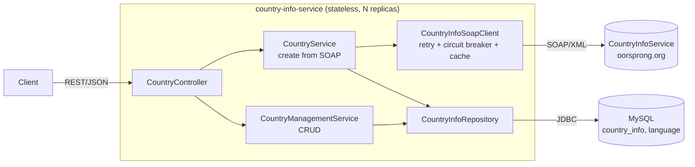
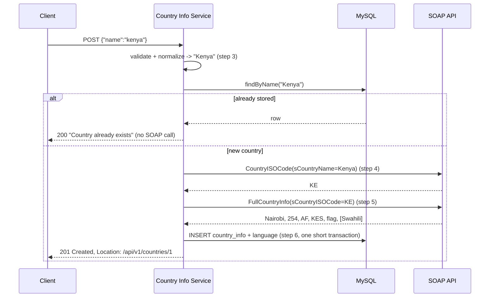
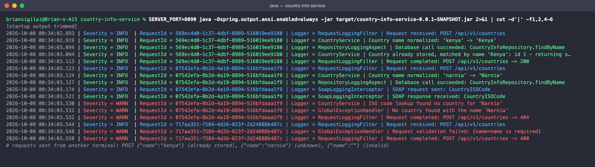

# Country Info Service

A Spring Boot microservice that integrates a public **SOAP** API with a **REST** API backed by
**MySQL**, deployable to **Kubernetes**.

It receives a country name, resolves its ISO code and full details from the
[CountryInfoService SOAP API](http://webservices.oorsprong.org/websamples.countryinfo/CountryInfoService.wso?WSDL),
stores the result with its languages, and exposes CRUD endpoints over the stored data.

| | |
|---|---|
| **Stack** | Java 21, Spring Boot 4.1, Spring MVC (virtual threads), Spring Web Services + JAXB, Spring Data JPA, Flyway, MySQL 8.4, Resilience4j, Caffeine, Micrometer/Prometheus, springdoc-openapi |
| **API docs** | Swagger UI at `/swagger-ui.html`, OpenAPI spec at `/v3/api-docs` |
| **Tests** | 45 unit, slice and integration tests (`./mvnw test`) |
| **Deployment** | Dockerfile + Kustomize manifests for the microservice + `scripts/deploy.sh` ([guide](docs/DEPLOYMENT.md), [troubleshooting](docs/TROUBLESHOOTING.md)); the database is external |

---

## Contents

- [How it works](#how-it-works)
- [API](#api)
- [Run locally](#run-locally)
- [Test](#test)
- [Deploy to Kubernetes](#deploy-to-kubernetes)
- [System design and decisions](#system-design-and-decisions)
- [How the requirements are met](#how-the-requirements-are-met)
- [Configuration](#configuration)
- [Project structure](#project-structure)

---

## How it works



`POST /api/v1/countries` with `{"name": "kenya"}`:



1. **Step 3:** the name is validated and normalized. Every word is capitalized, because the SOAP service is case-sensitive: `kenya` is not found but `Kenya` is, and `United states` is not found but `United States` is.
2. **Step 4:** the `CountryISOCode` SOAP operation returns the ISO code. Its "No country found by that name" answer becomes a **404**.
3. **Step 5:** `FullCountryInfo` returns the capital, phone code, continent, currency, flag and languages. Unknown codes come back as an empty record (not a SOAP fault), which is also detected and turned into a 404.
4. **Step 6:** the country and its languages are stored as `CountryInfo` 1→N `Language`.
5. **Step 7:** CRUD endpoints read, update and delete the stored data.

---

## API

Base path `/api/v1/countries`. Full, interactive documentation: **Swagger UI** at
http://localhost:8080/swagger-ui.html.

| Method | Path | Description | Success | Errors |
|---|---|---|---|---|
| `POST` | `/api/v1/countries` | Submit a country name; fetch from SOAP and store | `201` (new), `200` (already stored) | `400`, `404`, `503` |
| `GET` | `/api/v1/countries?page=0&size=20&sort=name,asc` | Fetch all (paginated, max 100 per page) | `200` | `400` (unknown sort field) |
| `GET` | `/api/v1/countries/{id}` | Fetch by ID | `200` | `400`, `404` |
| `PUT` | `/api/v1/countries/{id}` | Update (full replacement, including languages) | `200` | `400`, `404`, `409` |
| `DELETE` | `/api/v1/countries/{id}` | Delete (with its languages) | `200` | `404` |

Every response, success or error, uses the same envelope and carries the request ID that appears
in every log line for that request (also returned in the `X-Request-ID` header):

```json
{
  "responseCode": "201",
  "responseMessage": "Country information stored",
  "requestId": "bdbcf877-69f7-4a02-9260-d346d4507109",
  "timestamp": "2026-10-07T19:14:24.917705Z",
  "data": {
    "id": 1,
    "isoCode": "KE",
    "name": "Kenya",
    "capitalCity": "Nairobi",
    "phoneCode": "254",
    "continentCode": "AF",
    "currencyIsoCode": "KES",
    "countryFlag": "http://www.oorsprong.org/WebSamples.CountryInfo/Flags/Kenya.jpg",
    "languages": [{ "isoCode": "swa", "name": "Swahili" }],
    "version": 0,
    "createdAt": "2026-10-07T19:14:24.894811Z",
    "updatedAt": "2026-10-07T19:14:24.894826Z"
  }
}
```

Validation errors list every invalid field:

```json
{
  "responseCode": "400",
  "responseMessage": "Request validation failed",
  "requestId": "0f6acbee-bc28-4101-a653-fa4d51df52d2",
  "timestamp": "2026-10-07T18:41:10.934514Z",
  "errors": { "isoCode": "isoCode must be 2 or 3 letters", "languages[0].isoCode": "language isoCode must be 2-10 letters" }
}
```

| Status | When |
|---|---|
| `400` | Invalid body, path or query parameter, or malformed JSON |
| `404` | Unknown country name (SOAP) or unknown ID |
| `405` / `415` | Wrong HTTP method / not `application/json` |
| `409` | ISO code already used by another country, or stale `version` on `PUT` (optimistic locking) |
| `503` | SOAP service down or slow after retries, or circuit breaker open (`Retry-After: 30`); database timeout or outage (`Retry-After: 5`) |
| `500` | Unexpected error (details only in the logs, linked by `requestId`) |

---

## Run locally

### Prerequisites

Java 21 and Docker (on macOS, for example: `brew install openjdk@21 colima docker && colima start`).
Maven is not needed; the project includes the Maven wrapper `./mvnw`.

### 1. Start MySQL

```bash
docker run -d --name mysql -p 3306:3306 -e MYSQL_ROOT_PASSWORD=root -e MYSQL_DATABASE=countrydb -e MYSQL_USER=app -e MYSQL_PASSWORD=app -v mysql-data:/var/lib/mysql mysql:8.4
```

The defaults in `application.properties` match this container. Flyway creates the tables on
startup.

### 2. Start the service

```bash
./mvnw spring-boot:run
```

Check that it is up:

```bash
curl -s http://localhost:8080/actuator/health
```

### 3. Try it

Create (fetches from SOAP and stores):

```bash
curl -s -X POST http://localhost:8080/api/v1/countries -H "Content-Type: application/json" -d '{"name": "kenya"}'
```

List:

```bash
curl -s "http://localhost:8080/api/v1/countries?page=0&size=10&sort=name,asc"
```

Get by ID:

```bash
curl -s http://localhost:8080/api/v1/countries/1
```

Update (send the `version` from your last read):

```bash
curl -s -X PUT http://localhost:8080/api/v1/countries/1 -H "Content-Type: application/json" -d '{"isoCode":"KE","name":"Kenya","capitalCity":"Nairobi","phoneCode":"254","continentCode":"AF","currencyIsoCode":"KES","countryFlag":"http://www.oorsprong.org/WebSamples.CountryInfo/Flags/Kenya.jpg","languages":[{"isoCode":"swa","name":"Swahili"},{"isoCode":"eng","name":"English"}],"version":0}'
```

Delete:

```bash
curl -s -X DELETE http://localhost:8080/api/v1/countries/1
```

### SoapUI

To call the upstream SOAP operations directly (as in steps 2, 4 and 5 of the exercise), create a
SOAP project in SoapUI from
`http://webservices.oorsprong.org/websamples.countryinfo/CountryInfoService.wso?WSDL`, then run
`CountryISOCode` with `sCountryName = Kenya` (returns `KE`) and `FullCountryInfo` with
`sCountryISOCode = KE`. Our own API is REST/JSON, so test it from SoapUI with a **REST** project
pointed at `http://localhost:8080/api/v1/countries`.

---

## Test

```bash
./mvnw test
```

| Test class | Type | What it covers |
|---|---|---|
| `CountryNameFormatterTest` | unit | Name normalization (`kenya` → `Kenya`, `united states` → `United States`, `guinea-bissau` → `Guinea-Bissau`) |
| `CountryInfoSoapClientTest` | unit + mock SOAP server | Request/response marshalling for both operations, and both "not found" formats |
| `CountryServiceTest` | unit | Stored countries skip SOAP; new countries are fetched and stored; a lost insert race returns the other request's row |
| `CountryControllerTest` | web slice | `POST`: 201/200/404/503, validation, malformed JSON, 405 |
| `CountryCrudControllerTest` | web slice | `GET`/`PUT`/`DELETE`: status codes, envelope, per-field validation errors, 409, database timeout/outage → 503 |
| `DatabaseFailuresTest` | unit | Recognizes timeouts from every layer (query, lock wait, transaction, pool, socket) and nothing else |
| `CountryCrudIntegrationTest` | integration, real MySQL | Flyway schema, language replacement without constraint violations, optimistic locking, cascade delete, sort whitelist (each test rolls back) |
| `CountryInfoServiceApplicationTests` | integration | Application context starts against MySQL |

`CountryCrudIntegrationTest` and `CountryInfoServiceApplicationTests` need the local MySQL from
[Run locally](#1-start-mysql). The other tests have no external dependencies.

Against a running Kubernetes deployment, `scripts/smoke-test.sh` runs 11 end-to-end checks.

---

## Deploy to Kubernetes

In **production**, changes reach the cluster through a GitOps pipeline: GitHub Actions builds,
tests, scans and pushes an image tagged with the commit SHA, bumps the tag in a gitops repo, and
Argo CD syncs it to OpenShift ([details](docs/DEPLOYMENT.md#cicd-to-openshift-gitops)).

To deploy **locally** on minikube, use the same Dockerfile and manifests with one script. The
Kubernetes deployment contains only the microservice; the MySQL database is external (a managed
database in production; for minikube, the local Docker MySQL from [Run locally](#1-start-mysql),
reached at `host.minikube.internal`).

```bash
DB_USERNAME=app DB_PASSWORD=app scripts/deploy.sh
```

```bash
scripts/smoke-test.sh
```

`deploy.sh` builds the image, loads it into minikube, creates the database Secret from your
credentials (never committed), applies the Kustomize manifests in `k8s/` and waits for the rollout.

- **[docs/DEPLOYMENT.md](docs/DEPLOYMENT.md):** what gets deployed, prerequisites, verification, new versions and rollbacks, configuration and credential changes, scaling, the **GitOps CI/CD flow to OpenShift** (GitHub Actions → registry → gitops repo → Argo CD), other clusters, and a production checklist.
- **[docs/TROUBLESHOOTING.md](docs/TROUBLESHOOTING.md):** a by-symptom map, 60-second triage, what each probe failure does, a pod status → cause → fix table (Pending, ImagePullBackOff, CreateContainerConfigError, CrashLoopBackOff, OOMKilled, Evicted, running-but-no-traffic), step-by-step reproductions of common failures, API and SOAP issues, tracing a request by its `requestId`, scaling, logs, and a diagnostics bundle.

Verified on minikube:
- the smoke test passes 11/11
- 540/540 requests succeeded during a rolling restart
- a deleted pod is replaced automatically
- re-running `deploy.sh` with no changes restarts nothing
- pods stay up (0 restarts) and reconnect when the database restarts

---

## System design and decisions

### Integration pattern

- **The SOAP contract is pinned in the repository.** The WSDL lives in `src/main/resources/wsdl/`, and the JAXB classes are generated from it at build time (`jaxb-maven-plugin`, output in `target/generated-sources/xjc`).
  - *Why:* builds don't depend on a free demo server being up, and contract changes show up as a reviewed diff.
  - *Trade-off:* if the provider changes its contract, the WSDL has to be downloaded again manually.
- **The generated SOAP types stay inside the `soap` package.** The client converts them to immutable records (`CountryDetails`, `LanguageDetails`), so the service, controller and entities never depend on generated classes. A contract change only affects `soap/`.
- **One shared circuit breaker for both SOAP operations,** because they call the same host. If one operation fails, the other will too.

### Resilience (failures of the external service)

| Mechanism | Setting | Why |
|---|---|---|
| Timeouts | connect 3s, read 5s | A hung upstream must never hold request threads indefinitely |
| Retry | 3 attempts, exponential backoff 500ms → 1s | Absorbs temporary failures: I/O errors, timeouts, HTTP 5xx, SOAP faults, non-XML error pages |
| Circuit breaker | opens at ≥50% failures over the last 10 calls (min 5); open for 30s; tests recovery with 3 calls | Stops calling a dead upstream, so requests fail in ~3 ms instead of ~1.5 s |
| Fallback | → `503` with `Retry-After: 30` | A clear, retryable error instead of a 500 |
| Not-found answers | no retry, not counted as a failure | A valid business answer is not an outage |
| Graceful degradation | stored countries are served from MySQL | GET endpoints and repeat POSTs keep working while SOAP is down |

The **database** has the same protection, so no call to MySQL can hang a request:

| Timeout | Value | Covers |
|---|---|---|
| Pool wait (`DB_POOL_TIMEOUT_MS`) | 5s | No free connection (pool exhausted, or MySQL unreachable) |
| TCP connect (`DB_CONNECT_TIMEOUT_MS`) | 3s | MySQL host down |
| Query (`DB_QUERY_TIMEOUT_MS`) | 5s | Slow queries |
| Row-lock wait (`DB_LOCK_WAIT_TIMEOUT_S`) | 5s | Another transaction holds the row (MySQL's default is 50s) |
| Transaction (`DB_TRANSACTION_TIMEOUT`) | 10s | Whole transaction; Hibernate applies the remaining time to every statement |
| Socket read (`DB_SOCKET_TIMEOUT_MS`) | 15s | Last resort if MySQL stops responding mid-query |

Any of these becomes a `DatabaseTimeoutException`, logged as `logType="DATABASE_TIMEOUT"`, and returns
`503` with `Retry-After: 5` and the message "The database is taking too long to respond". A MySQL
outage returns `503` "temporarily unavailable". Tested:
- a row held by another transaction → 503 after 5.2 s (reads of the same row are unaffected)
- MySQL frozen with `docker pause` → 503 after 8 s
- automatic recovery as soon as MySQL is back

The circuit breaker wraps the retry (`CircuitBreaker → Retry → call`), so each request counts as
one failure after its retries, and nothing is retried while the circuit is open. This order is set
explicitly: with Resilience4j's default order, the fallback would convert the exception before the
retry saw it, and nothing would be retried (found and fixed while testing).

### Data and consistency

- **The schema is owned by Flyway** (`db/migration/V1__...sql`). Hibernate only validates it (`ddl-auto=validate`), so it never alters production tables.
- **`iso_code` is unique.** Creating a country is idempotent: a country already stored is returned with 200, and concurrent creates of the same country are settled by the unique constraint (the losing requests return the winner's row). Tested with 6 parallel requests: one 201, five 200s, one row.
- **No transaction stays open during SOAP calls.** The remote calls happen first; then the country and its languages are saved in one short transaction, so slow upstream calls can't exhaust the connection pool.
- **Optimistic locking (`@Version`)** prevents lost updates. `PUT` with a stale `version` returns 409.
- **One country has many languages** (rather than a shared language table with a many-to-many link).
  - *Trade-off:* "Swahili" is stored once per country.
  - *Benefit:* editing or deleting one country never affects another.
  - Languages are matched by ISO code on update, which avoids Hibernate's insert-before-delete ordering breaking the `(country_id, iso_code)` unique constraint.
- **No N+1 queries.** Listing takes 2 SQL queries regardless of page size: the countries, then all their languages in one batch (`default_batch_fetch_size`).

### Scalability (high load)

- **Stateless service.** No HTTP sessions and no local state that must be shared, so any replica can serve any request. The HPA scales 2 → 5 pods on CPU.
- **Java 21 virtual threads.** Each request runs on a cheap virtual thread, so blocking JDBC and SOAP calls scale to high concurrency without a reactive stack. *Why not WebFlux:* JPA is blocking, and wrapping it in `Mono` adds complexity without the benefit.
- **Caching:** the ISO code and full-info lookups are cached in memory per pod with Caffeine (max 1000 entries, 24 h).
  - *Why:* this reference data rarely changes, and a hit avoids two remote calls (a cached lookup takes ~3 ms vs ~300 ms).
  - *Trade-off:* each pod has its own cache. A shared Redis cache would raise the hit rate at many replicas but adds a dependency.
- **Load balancing:** the Kubernetes Service spreads traffic across ready pods. Readiness probes and graceful shutdown remove pods from rotation cleanly.
- **Queuing was considered and not used.** The API is synchronous request/response and the SOAP lookups are fast and cached. If bulk imports were needed, a queue (e.g. Kafka or RabbitMQ) with consumers calling SOAP would decouple the work from user requests.
- **Database protection:** the connection pool is limited per pod (`DB_POOL_SIZE`, default 10), page size is capped at 100, and sort fields are whitelisted.

### Observability

- **Structured logs.** Each event is written through a `StructuredLog` builder:
  ```java
  StructuredLog.of(getClass()).setLogMessage(...).setLogLevel("info").setResponseCode("201")
          .setTargetSystem("MySQL").setProcessName(...).setLogStatus(SUCCESS_STATUS)
          .setTransactionCost(ms).write();
  ```
  The output is pipe-delimited, with `key="value"` fields that log tools can parse.
- **A request ID on every line.** Every line carries a `requestId` (taken from the caller's `X-Request-ID`, or generated), so one search shows a request's complete path across pods: the incoming request → the SOAP request and response (with XML payloads) → each database call with its duration → the response code and total time.
- **What's logged automatically:**
  - every incoming request and response (filter)
  - every SOAP call (client interceptor)
  - every repository call (AOP aspect)
  - every error response (global exception handler)
- **Colors by outcome** in the console (IntelliJ, terminals): green = `SUCCESS`, red = `FAILED`/ERROR, yellow = WARN, cyan = `IN_PROGRESS`. Colors are switched off automatically when there's no terminal (Kubernetes pods, CI) and are never written to the log file.

  
- **Masking:** phone numbers and SOAP passwords are masked in all log output.
- **Metrics** at `/actuator/prometheus`:
  - HTTP latency and status codes
  - `soap_client_requests_seconds{operation,outcome}`
  - circuit-breaker state and retry counts
  - cache hit/miss counts
  - JVM, HikariCP connection pool
- **Health:** `/actuator/health/liveness` and `/readiness` feed the Kubernetes probes. Liveness deliberately doesn't check MySQL or SOAP, so an outage of a dependency doesn't restart every pod.

### Separation of concerns (MVC)

`controller` (HTTP and validation) → `service` (business flow; `CountryService` for
create-from-SOAP, `CountryManagementService` for CRUD) → `soap` (external integration) and
`repository` (persistence). `dto` (API contract), `entity` (database model) and `soap/model` are
separate types, connected by `mapper`.

### Things worth knowing

- The upstream data is used as-is. For example, it returns *Dar es Salaam* as Tanzania's capital; `PUT` can correct stored records.
- The SOAP service stores some multi-word names in its own format (e.g. "Bosnia and Herzegovina" is not found under any capitalization), so those return 404.
- `DELETE` returns `200` with the response envelope rather than `204`, to keep every response in the same envelope format.

---

## How the requirements are met

**Tasks**

| # | Requirement | Where |
|---|---|---|
| 1 | Spring Boot app with Web, Data JPA, MySQL Driver | `pom.xml` (plus Web Services, Validation, Actuator, Flyway, Resilience4j, Cache, springdoc) |
| 2 | SoapUI + WSDL import | WSDL in `src/main/resources/wsdl/`; see [SoapUI](#soapui) |
| 3 | `POST` receives `{"name": ...}` and converts it to sentence case | `CountryController#createCountry`, `CountryNameFormatter` |
| 4 | Call `CountryISOCode` with `sCountryName` | `CountryInfoSoapClient#getIsoCode` |
| 5 | Use the ISO code to call `FullCountryInfo` | `CountryInfoSoapClient#getFullCountryInfo` |
| 6 | Models `CountryInfo` and `Language` | `entity/`, Flyway `V1__create_country_info_and_language.sql` |
| 7 | Fetch all, fetch by ID, update, delete | `CountryController`, `CountryManagementService` |
| 8 | Kubernetes deployment scripts | `Dockerfile`, `k8s/`, `scripts/deploy.sh`, `scripts/teardown.sh`, `scripts/smoke-test.sh` |
| 9 | Deployment guide | [docs/DEPLOYMENT.md](docs/DEPLOYMENT.md) |
| 10 | Troubleshooting guide | [docs/TROUBLESHOOTING.md](docs/TROUBLESHOOTING.md) |

**Important Notes**

| Note | How it is addressed |
|---|---|
| System design, integration patterns, trade-offs | [System design and decisions](#system-design-and-decisions) |
| High load: stateless, horizontal scaling, caching, queuing, load balancing | [Scalability](#scalability-high-load) |
| Retries, timeouts, circuit breakers, fallbacks | [Resilience](#resilience-failures-of-the-external-service) |
| Structured logging, metrics, monitoring, tracing | [Observability](#observability) |
| MVC separation of concerns | [Separation of concerns](#separation-of-concerns-mvc) |
| Robust error handling, proper HTTP codes, friendly messages | `GlobalExceptionHandler`, [API](#api) |
| Production-ready deployment: containers, config management, health checks, scalability | `Dockerfile`, `k8s/` (ConfigMap, Secret, probes, HPA, PDB, rolling updates, non-root, read-only filesystem; external database) |
| Steps to run and test | [Run locally](#run-locally), [Test](#test), [Deploy](#deploy-to-kubernetes) |

---

## Configuration

All settings have local defaults in `src/main/resources/application.properties` and can be
overridden with environment variables (in Kubernetes: `k8s/app/config.env` and the
`country-info-db` Secret created by `deploy.sh`).

| Variable | Default | Purpose |
|---|---|---|
| `SERVER_PORT` | `8080` | HTTP port |
| `DB_URL` | `jdbc:mysql://localhost:3306/countrydb` | JDBC URL |
| `DB_USERNAME` / `DB_PASSWORD` | `app` / `app` | Database credentials (from a Secret in Kubernetes) |
| `DB_POOL_SIZE` | `10` | Max DB connections per instance |
| `DB_POOL_TIMEOUT_MS` / `DB_CONNECT_TIMEOUT_MS` / `DB_SOCKET_TIMEOUT_MS` | `5000` / `3000` / `15000` | Wait for a pooled connection / TCP connect / socket read |
| `DB_QUERY_TIMEOUT_MS` / `DB_LOCK_WAIT_TIMEOUT_S` / `DB_TRANSACTION_TIMEOUT` | `5000` / `5` / `10s` | Per query / row-lock wait / whole transaction |
| `SOAP_COUNTRY_INFO_URL` | `http://webservices.oorsprong.org/websamples.countryinfo/CountryInfoService.wso` | SOAP endpoint |
| `SOAP_CONNECT_TIMEOUT` / `SOAP_READ_TIMEOUT` | `3s` / `5s` | SOAP timeouts |
| `APP_LOG_LEVEL` | `INFO` | Log level for `com.ncba.countryinfo` |
| `LOG_PATH` | `/tmp/logs` | Directory for the rolling log file |

Retry, circuit breaker, cache and pagination settings are in `application.properties` with
comments; the log format and masking are in `logback-spring.xml`.

---

## Project structure

```
├── Dockerfile                      multi-stage image build
├── k8s/                            Kustomize manifests for the microservice (Deployment, Service, HPA, PDB, config)
├── scripts/                        deploy.sh, smoke-test.sh, teardown.sh
├── docs/                           DEPLOYMENT.md, TROUBLESHOOTING.md, images/ (diagrams), screenshots/
└── src/main/
    ├── java/com/ncba/countryinfo/
    │   ├── controller/             REST endpoints (+ OpenAPI annotations)
    │   ├── service/                CountryService (SOAP → DB), CountryManagementService (CRUD)
    │   ├── soap/                   SOAP client, logging interceptor, model records
    │   ├── repository/             Spring Data JPA repository
    │   ├── entity/                 CountryInfo, Language
    │   ├── dto/                    request/response records, WsResponse envelope
    │   ├── mapper/                 SOAP model ↔ entity ↔ DTO
    │   ├── exception/              domain exceptions + GlobalExceptionHandler
    │   ├── logging/                StructuredLog, request filter, repository aspect
    │   ├── config/                 SOAP client, cache, OpenAPI configuration
    │   └── util/                   CountryNameFormatter
    └── resources/
        ├── application.properties
        ├── logback-spring.xml      log format and masking
        ├── db/migration/           Flyway migrations
        └── wsdl/                   CountryInfoService.wsdl (JAXB classes generated from it)
```
