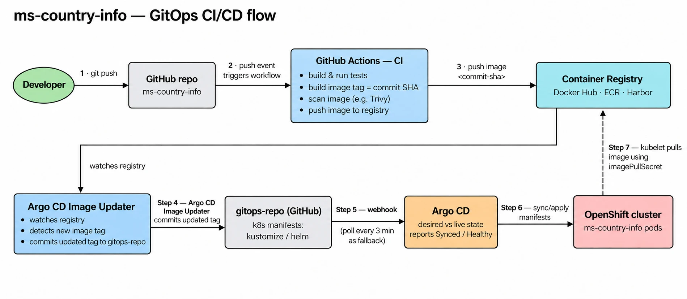
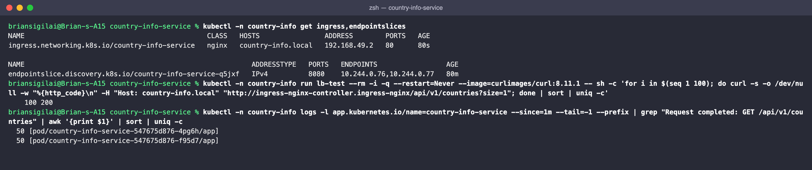
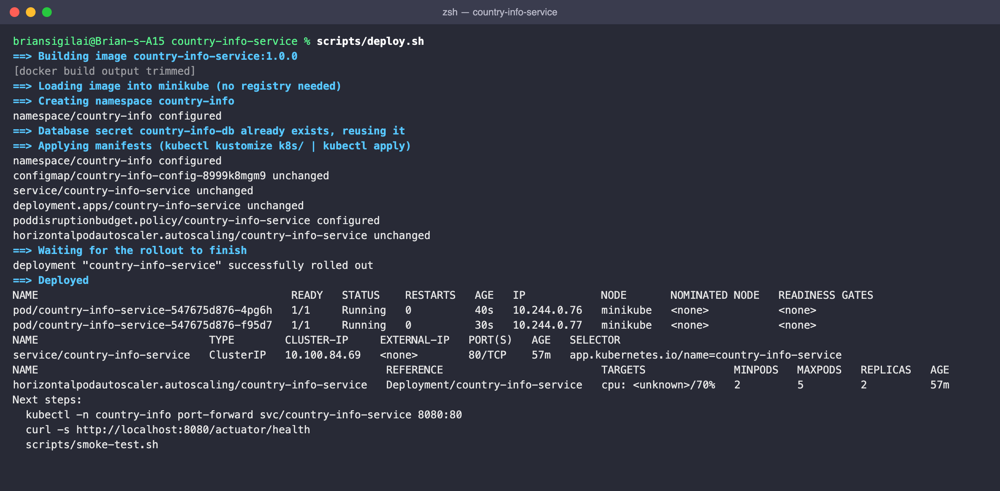
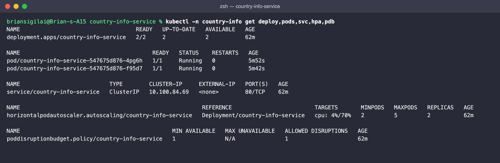
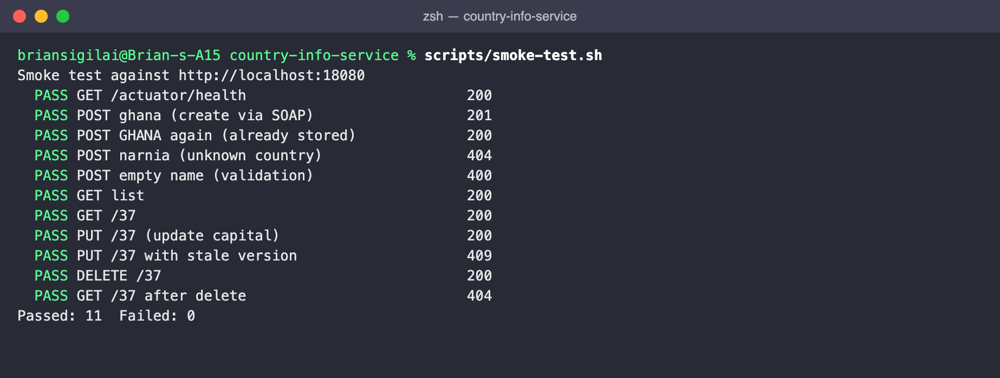
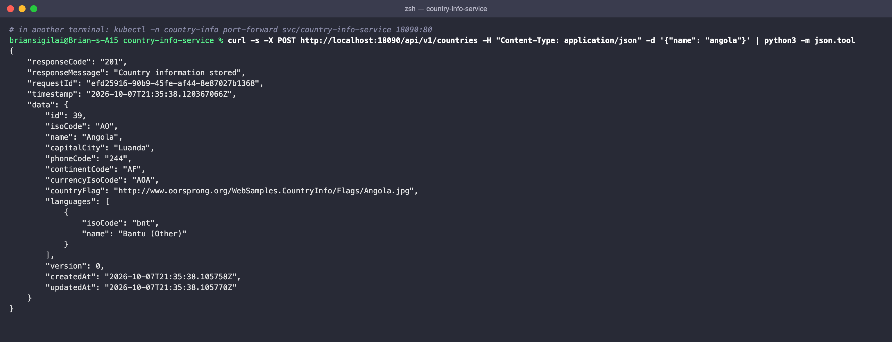
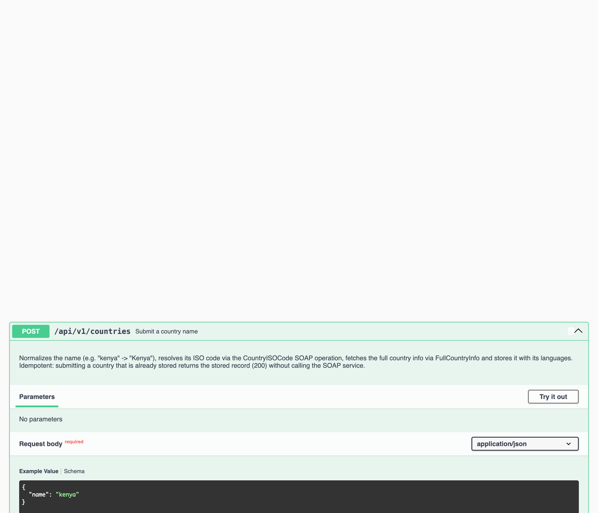
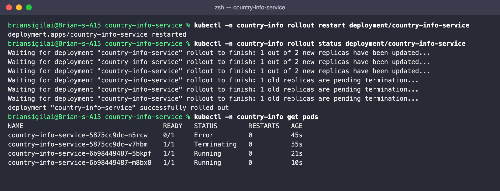
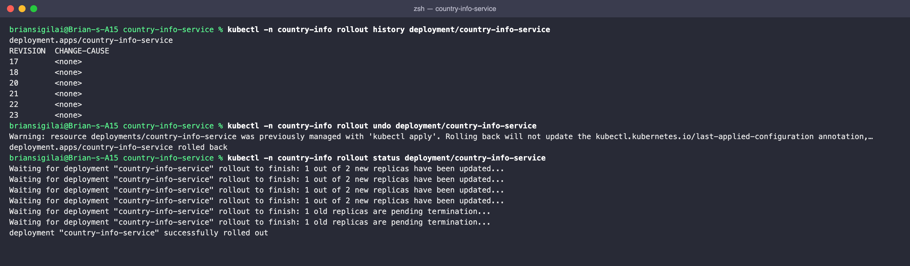
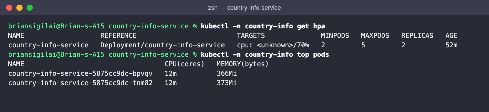

# Deploying to Kubernetes

**Production, GitOps** (GitHub Actions → registry → gitops repo → Argo CD → OpenShift): every
change reaches the cluster through Git. See [CI/CD to OpenShift (GitOps)](#cicd-to-openshift-gitops).

Clients reach the pods through the OpenShift Route, which balances requests **round robin** (see
[Load balancing](#load-balancing-round-robin)).

This guide also shows how we deployed and verified it **locally** on minikube (Docker driver,
running on Colima on macOS), using the same Dockerfile and manifests the pipeline deploys. See
[Local deployment (minikube)](#local-deployment-minikube).

The deployment contains only the **country-info-service** microservice. The MySQL database is
external: a managed database (RDS, Cloud SQL, Azure Database) in production, and the Docker MySQL
from the [README](../README.md#1-start-mysql) locally. The manifests are plain Kubernetes and also
work on other clusters (see [Other clusters](#other-clusters)).

## What gets deployed

```
                         namespace: country-info
 ┌──────────────────────────────────────────────────────────────────────┐
 │                                                                      │
 │   Service country-info-service (ClusterIP :80)  ◄── load-balances    │
 │          │                                                           │
 │          ▼                                                           │
 │   Deployment country-info-service     HPA: 2-5 pods @ 70% CPU        │
 │   ├── pod (Spring Boot, :8080)         PDB: min 1 available          │
 │   └── pod (Spring Boot, :8080)                                       │
 │          env: ConfigMap country-info-config + Secret country-info-db │
 │                                                                      │
 └──────────┬───────────────────────────────────────┬───────────────────┘
            │ JDBC (DB_URL)                          │ HTTP (SOAP)
            ▼                                        ▼
   External MySQL                           webservices.oorsprong.org
   (managed DB / local Docker MySQL)        CountryInfoService.wso
```

| File | Resource | Purpose |
|---|---|---|
| `Dockerfile` | image | Multi-stage build (JDK → JRE 21), layered jar, non-root user (uid 1001), heap sized from the container limit |
| `k8s/namespace.yaml` | Namespace | Isolates everything in `country-info` |
| `k8s/app/config.env` | ConfigMap (generated) | Non-secret config: database URL, SOAP URL and timeouts, log level |
| `k8s/app/deployment.yaml` | Deployment | 2 replicas, zero-downtime rolling updates, startup/readiness/liveness probes, resource limits, read-only root filesystem |
| `k8s/app/service.yaml` | Service (ClusterIP) | Stable name for the pods; selects the ready pods |
| `k8s/openshift/route.yaml` | Route (OpenShift) | Production entry point: TLS, **round robin** across the pods, no sticky sessions |
| `k8s/local/ingress.yaml` | Ingress (minikube) | Local entry point through ingress-nginx, round robin |
| `k8s/app/hpa.yaml` | HorizontalPodAutoscaler | Scales 2 → 5 pods when average CPU > 70% |
| `k8s/app/pdb.yaml` | PodDisruptionBudget | Keeps at least 1 pod up during node drains and upgrades |
| `k8s/kustomization.yaml` | Kustomize | Ties it together; sets the namespace, labels and image tag |
| *(created by `deploy.sh`)* | Secret `country-info-db` | Database username and password, from your environment. **Never committed** |

## CI/CD to OpenShift (GitOps)

In production the service is not deployed with `deploy.sh`. A commit flows to the cluster through
CI (GitHub Actions) and GitOps CD (Argo CD), so the cluster always matches what is in Git:



| Step | What happens | Tooling and notes |
|---|---|---|
| 1 | Developer pushes to the app repo `ms-country-info` | Pull request + review on `main` |
| 2 | The push triggers the CI workflow | GitHub Actions |
| CI | Build and run the tests (`./mvnw verify`), build the image tagged with the **commit SHA**, scan it (e.g. Trivy, fail on HIGH/CRITICAL), push it | The same `Dockerfile` as locally |
| 3 | The image is pushed to the registry as `ms-country-info:<commit-sha>` | Docker Hub, ECR, Harbor or the OpenShift internal registry |
| 4 | Argo CD Image Updater watches the registry, detects the new image tag, and commits the updated tag to the **gitops repo** | The gitops repo holds the manifests from `k8s/` with one overlay per environment; CI does not need write access to this repo |
| 5 | Argo CD notices the commit (webhook, or polling every 3 minutes as a fallback) | Compares desired state (Git) with live state (cluster) |
| 6 | Argo CD syncs: applies the manifests and reports **Synced / Healthy** | Health uses the Deployment rollout, i.e. the readiness probes |
| 7 | The kubelet pulls the image with an `imagePullSecret` | Private registry credentials stored as a Secret in the namespace |

Why it is built this way:

- **Tag images with the commit SHA, never `:latest`.** Every build gets a unique, traceable tag. Image Updater writes the selected tag into Git; a mutable `:latest` tag would not create a manifest diff for Argo CD to sync.
- **Git is the single source of truth.** Every deployment is a commit, so it is reviewed, audited and reverted with `git revert` (Argo CD then rolls back). No one needs `kubectl apply` access to production.
- **Image Updater owns the image-tag update.** Configure it to watch the service image in the registry and write tag changes back to the gitops repo. Give it registry read access and narrowly scoped Git write credentials; the CI workflow only needs to build, scan and push the image.
- **Secrets stay out of Git:** the `country-info-db` Secret and the registry `imagePullSecret` come from a secrets manager (External Secrets Operator, Sealed Secrets or Vault), not from the gitops repo.

What changes on **OpenShift**:

- `oc` works like `kubectl` (`oc get pods`, `oc logs`, `oc rollout status ...`), and a project is a namespace.
- OpenShift runs each pod with a random UID from the project's range, and its default `restricted-v2` SCC rejects the fixed `runAsUser: 1001`. Remove `runAsUser`/`runAsGroup`/`fsGroup` from `deployment.yaml` in the OpenShift overlay and let OpenShift assign them. The image still works with any UID: the application files in `/app` are world-readable, and the app only writes to `/tmp`, which is an `emptyDir`.
- Expose the API with the **Route** in `k8s/openshift/route.yaml` (TLS edge termination, round robin,
  no sticky cookie), included by the OpenShift overlay; see [Load balancing](#load-balancing-round-robin).

An Argo CD `Application` for this service (in the gitops repo):

```yaml
apiVersion: argoproj.io/v1alpha1
kind: Application
metadata:
  name: ms-country-info
  namespace: openshift-gitops
spec:
  project: default
  source:
    repoURL: https://github.com/<org>/gitops-repo.git
    targetRevision: main
    path: apps/ms-country-info/overlays/prod      # kustomize overlay based on k8s/
  destination:
    server: https://kubernetes.default.svc
    namespace: country-info
  syncPolicy:
    automated:
      prune: true        # delete resources removed from Git
      selfHeal: true     # revert manual changes made in the cluster
    syncOptions:
      - CreateNamespace=true
```

## Load balancing (round robin)

The service is **stateless**: no HTTP sessions and no state on the pod (all data is in MySQL, and
the caches only hold reference data). Any pod can serve any request, so load is spread with
**round robin**, one request to each ready pod in turn, at the point where traffic enters the
cluster.

### Within a cluster (OpenShift Route)

```
 clients ──HTTPS──► OpenShift router (HAProxy) ── Route country-info-service
                     TLS edge · balance roundrobin · no sticky cookie
                              │  round robin, straight to the pod IPs of READY pods
               ┌──────────────┼──────────────┐
               ▼              ▼              ▼
             pod 1          pod 2    ...   pod N        (HPA: 2-5 pods)
```

The Route is in [`k8s/openshift/route.yaml`](../k8s/openshift/route.yaml) and is added by the
OpenShift overlay in the gitops repo. The settings that matter:

```yaml
metadata:
  annotations:
    haproxy.router.openshift.io/balance: roundrobin        # round robin across the pods
    haproxy.router.openshift.io/disable_cookies: "true"    # no sticky sessions
    haproxy.router.openshift.io/timeout: 30s
spec:
  tls:
    termination: edge
    insecureEdgeTerminationPolicy: Redirect
```

- **Set `balance: roundrobin` explicitly.** The router's default algorithm depends on the OpenShift version.
- **Disable the cookie.** Edge and re-encrypt routes add a sticky-session cookie by default, which pins each browser to one pod and defeats round robin. The service is stateless, so stickiness is not needed.
- **Round robin happens at the Route, not the Service.** The router sends requests straight to the pod endpoints. A plain `Service` ClusterIP (used for pod-to-pod calls inside the cluster) picks endpoints at random with kube-proxy/OVN: even over many requests, but not strict round robin.

### Across clusters

For high availability across data centers, two OpenShift clusters run the same service and a
global load balancer distributes clients between them, also round robin:

```
                       clients
                          │  country-info.<domain>
                          ▼
          Global load balancer (e.g. F5 BIG-IP DNS/GTM)
          round robin · health check per cluster
             ┌─────────────────┴─────────────────┐
             ▼                                   ▼
   OpenShift cluster A (DC1)           OpenShift cluster B (DC2)
   Route → pods (round robin)          Route → pods (round robin)
             └─────────────────┬─────────────────┘
                               ▼
                  MySQL (replicated, reachable from both)
```

- **Health check:** the global load balancer probes `https://<cluster route>/actuator/health/readiness` and stops sending traffic to a cluster that fails.
- **Same version everywhere:** an Argo CD `ApplicationSet` with a cluster generator deploys the same gitops revision to both clusters.
- **Same hostname and certificate** on the Route in both clusters, so clients cannot tell which cluster served them.
- **Shared data:** both clusters use the same (replicated) database, which is what makes round robin across clusters safe for a stateless service.

### What keeps the rotation healthy

| Mechanism | Effect on load balancing |
|---|---|
| Readiness probe (`/actuator/health/readiness`) | A pod receives traffic only once it is ready, and is removed from the rotation as soon as it fails or starts shutting down |
| `preStop` (10s) + graceful shutdown (30s) | A terminating pod leaves the rotation first and finishes its in-flight requests (540/540 requests succeeded during a rolling restart) |
| HorizontalPodAutoscaler (2-5 pods at 70% CPU) | New pods join the rotation automatically when load rises |
| `topologySpreadConstraints` | Pods are spread across nodes, so one node failure removes only part of the rotation |
| PodDisruptionBudget (min 1 available) | Node drains and upgrades never empty the rotation |
| No session affinity | Every request is free to go to any pod |
| `DB_POOL_SIZE` per pod (10) | Database connections grow with the number of pods; keep `pods × 10` below the database limit |

### Verified locally (minikube)

Locally, the **ingress-nginx** controller plays the role of the OpenShift router.
[`k8s/local/ingress.yaml`](../k8s/local/ingress.yaml) routes `country-info.local` to the service,
and `scripts/deploy.sh` sets the controller's algorithm to `round_robin` (when the ingress addon is
enabled):

```bash
minikube addons enable ingress
```

```bash
scripts/deploy.sh
```

Send 100 requests through the ingress from inside the cluster, then count which pod served each one
(every request logs `Request completed` on the pod that handled it):

```bash
kubectl -n country-info run lb-test --rm -i -q --restart=Never --image=curlimages/curl:8.11.1 -- sh -c 'for i in $(seq 1 100); do curl -s -o /dev/null -w "%{http_code}\n" -H "Host: country-info.local" "http://ingress-nginx-controller.ingress-nginx/api/v1/countries?size=1"; done | sort | uniq -c'
```

```bash
kubectl -n country-info logs -l app.kubernetes.io/name=country-info-service --since=1m --tail=-1 --prefix | grep "Request completed: GET /api/v1/countries" | awk '{print $1}' | sort | uniq -c
```

All 100 requests succeeded and were split **exactly 50 / 50** across the two pods:



Over a long run the split is even. Two consecutive requests can still land on the same pod, because
each nginx worker process (4 here) keeps its own round-robin position.

## Local deployment (minikube)

This is how we deployed and tested the service for this exercise: one script on a laptop, using the
same Dockerfile and manifests that the GitOps pipeline deploys to OpenShift.

### Prerequisites

| Tool | Check | Install (macOS) |
|---|---|---|
| Docker engine | `docker info` | `brew install colima docker docker-buildx` then `colima start --cpu 4 --memory 8` |
| kubectl | `kubectl version --client` | `brew install kubectl` |
| minikube | `minikube version` | `brew install minikube` |

Start the cluster (once). `metrics-server` is needed for the autoscaler:

```bash
minikube start --driver=docker --cpus=2 --memory=4096
minikube addons enable metrics-server
```

**A MySQL database the cluster can reach**, with a `countrydb` schema and a user that can create
tables (Flyway creates and migrates them on startup). For local testing, start the Docker MySQL
from the README; pods reach it at `host.minikube.internal:3306`, which is already the `DB_URL` in
`k8s/app/config.env`. To use another database, change `DB_URL` there.

### Deploy (one command)

From the project root, passing the database credentials the first time:

```bash
DB_USERNAME=app DB_PASSWORD=app scripts/deploy.sh
```

The script:

1. Builds the image `country-info-service:1.0.0` (the first build takes ~6 minutes while Maven downloads dependencies; later builds reuse the cache).
2. Loads it into minikube with `minikube image load` (no registry needed).
3. Creates the namespace and the Secret `country-info-db` from `DB_USERNAME`/`DB_PASSWORD`. Later deploys reuse the Secret, so the credentials are only needed again to change them.
4. Applies the manifests (`kubectl kustomize k8s/ | kubectl apply -f -`).
5. Waits for the rollout and prints the pods, Service and HPA. If the rollout fails, it shows the pods and how to read their logs (usually the database at `DB_URL` is not reachable).

Expected end of the output:

```
pod/country-info-service-67d846ff7f-ccgxg   1/1   Running   0   10s
pod/country-info-service-67d846ff7f-kl9cl   1/1   Running   0   10s
service/country-info-service   ClusterIP   10.100.84.69   <none>   80/TCP   10s
horizontalpodautoscaler.autoscaling/country-info-service   Deployment/country-info-service   cpu: <unknown>/70%   2   5   2
```

The HPA shows `cpu: <unknown>/70%` for about a minute after pods start; that is normal (metrics-server needs a first sample).



All resources in the namespace:

```bash
kubectl -n country-info get deploy,pods,svc,hpa,pdb
```



The script is **idempotent**: running it again with no changes does not restart anything. Pods
roll only when the image content, the config or the database credentials changed.

### Verify

Automated end-to-end check (health, create via SOAP, duplicate create 409, 404, 400, list, get,
update, stale-version 409, delete):

```bash
scripts/smoke-test.sh
```

```
  PASS GET /actuator/health                          200
  PASS POST ghana (create via SOAP)                  201
  ...
  PASS GET /30 after delete                          404
Passed: 11  Failed: 0
```



Manual access through a port-forward:

```bash
kubectl -n country-info port-forward svc/country-info-service 8080:80
```

Then, in another terminal:

```bash
curl -s http://localhost:8080/actuator/health
```

```bash
curl -s -X POST http://localhost:8080/api/v1/countries -H "Content-Type: application/json" -d '{"name": "kenya"}'
```

```bash
curl -s "http://localhost:8080/api/v1/countries?page=0&size=10&sort=name,asc"
```

Swagger UI: http://localhost:8080/swagger-ui.html · Metrics: http://localhost:8080/actuator/prometheus





## Day-2 operations

The commands below operate the **local** deployment directly. In **production** the same operations
go through Git, and Argo CD applies them:

| Operation | Production (GitOps) | Local (minikube) |
|---|---|---|
| Deploy a new version | Merge to `main`: CI builds `ms-country-info:<commit-sha>` and bumps the tag in the gitops repo | `scripts/deploy.sh <tag>` |
| Roll back | `git revert` the tag bump in the gitops repo (or roll back to a previous sync in Argo CD) | `kubectl rollout undo` |
| Change configuration | Commit the change to the environment's `config.env` in the gitops repo | Edit `k8s/app/config.env`, run `scripts/deploy.sh` |
| Change DB credentials | Update the value in the secrets manager; External Secrets syncs the Secret | `DB_PASSWORD=... scripts/deploy.sh` |
| Scale | Commit new `minReplicas`/`maxReplicas` to the HPA in the gitops repo | Edit `k8s/app/hpa.yaml`, run `scripts/deploy.sh` |

### Deploy a new version

Change the code, then build and roll out under a new tag:

```bash
scripts/deploy.sh 1.0.1
```

The Deployment uses `maxSurge: 1, maxUnavailable: 0`: a new pod must pass its readiness probe
before an old one is removed, and old pods drain gracefully (`preStop` 10s, then Spring's graceful
shutdown for up to 30s). Tested: **540/540 requests succeeded** from inside the cluster during a
full rolling restart.

Watch it:

```bash
kubectl -n country-info rollout status deployment/country-info-service
```



### Roll back

```bash
kubectl -n country-info rollout undo deployment/country-info-service
```

```bash
kubectl -n country-info rollout history deployment/country-info-service
```



### Change configuration

Edit `k8s/app/config.env` (e.g. `APP_LOG_LEVEL=DEBUG`, `SOAP_READ_TIMEOUT=10s` or a different
`DB_URL`) and run `scripts/deploy.sh` again. Kustomize gives the ConfigMap a new hashed name, so
the pods roll onto the new config automatically. The database timeouts listed in the README
(`DB_QUERY_TIMEOUT_MS`, `DB_LOCK_WAIT_TIMEOUT_S`, ...) can be added there the same way.

### Change the database credentials

```bash
DB_USERNAME=app DB_PASSWORD='<new password>' scripts/deploy.sh
```

This updates the Secret and rolls the pods onto it.

### Scale

Automatic: the HPA keeps 2-5 replicas based on CPU. Check it with:

```bash
kubectl -n country-info get hpa
```

```bash
kubectl -n country-info top pods
```



To change the range, edit `minReplicas`/`maxReplicas` in `k8s/app/hpa.yaml` and redeploy. The
service is stateless (all state is in the database, caches are per pod and only hold reference
data), so any number of replicas can serve any request. Keep `replicas × DB_POOL_SIZE` (10 per
pod) below the database's connection limit.

## Tear down

Remove the microservice but keep the namespace and the database Secret (a later `deploy.sh` needs
no credentials):

```bash
scripts/teardown.sh
```

Remove everything, including the Secret:

```bash
scripts/teardown.sh --all
```

Neither touches the database or its data.

## Other clusters

The manifests are cluster-agnostic. On a managed cluster (EKS, GKE, AKS, OpenShift):

1. **Push the image to a registry** instead of `minikube image load`, and point `k8s/kustomization.yaml` at it:
   ```bash
   docker build -t <registry>/country-info-service:1.0.0 .
   ```
   ```bash
   docker push <registry>/country-info-service:1.0.0
   ```
   ```yaml
   images:
     - name: country-info-service
       newName: <registry>/country-info-service
       newTag: 1.0.0
   ```
2. **Point `DB_URL`** in `k8s/app/config.env` at the managed database, and allow the cluster's nodes or pods to reach it (security group, firewall rule, private endpoint).
3. **Create the Secret** with `kubectl create secret generic country-info-db --from-literal=username=... --from-literal=password=...` (as `deploy.sh` does) or, better, from a secrets manager (External Secrets Operator, Sealed Secrets, Vault).
4. **Expose the service** with an Ingress (TLS) or a `LoadBalancer` Service instead of port-forwarding.
5. **Scrape metrics**: the pods carry `prometheus.io/*` annotations for Prometheus; logs go to stdout for the cluster's log collector (Fluent Bit, Loki, CloudWatch, etc.).

## Production hardening checklist

Already in place: non-root user, read-only root filesystem, all capabilities dropped, seccomp
`RuntimeDefault`, resource requests/limits, three kinds of probes, graceful shutdown, PDB, HPA,
secrets out of git, schema migrations via Flyway, database and SOAP timeouts, structured logs to
stdout, Prometheus metrics.

Still recommended for a real environment:

- NetworkPolicy restricting egress to the database endpoint and the SOAP host.
- Ingress with TLS and authentication (OAuth2/JWT) in front of the API.
- Image scanning (Trivy/Grype) and signing (cosign) in CI; pin base images by digest.
- A distributed cache (Redis) if the per-pod Caffeine cache hit rate becomes too low at high replica counts.
- Alerts on `resilience4j_circuitbreaker_state{state="open"}`, 5xx rate, p95 latency and pod restarts.
