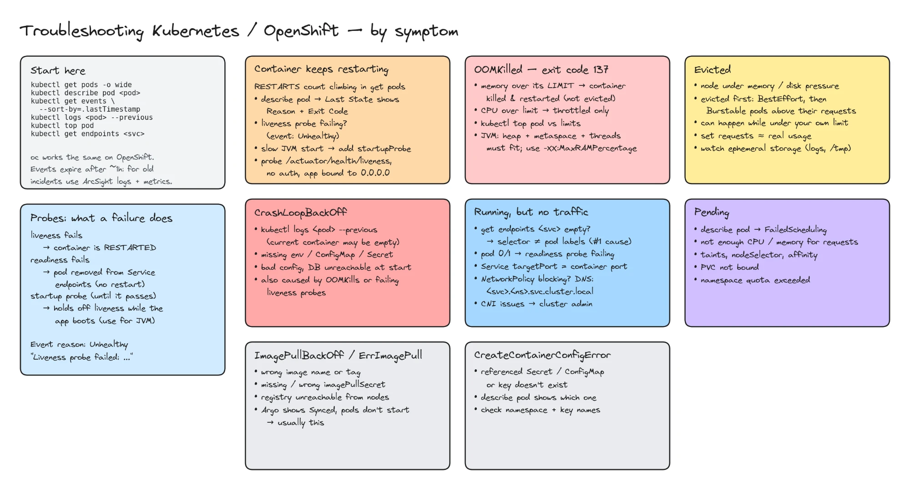
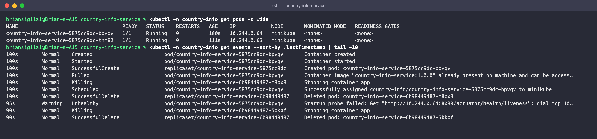
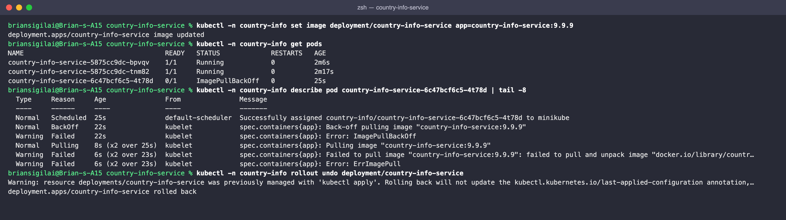
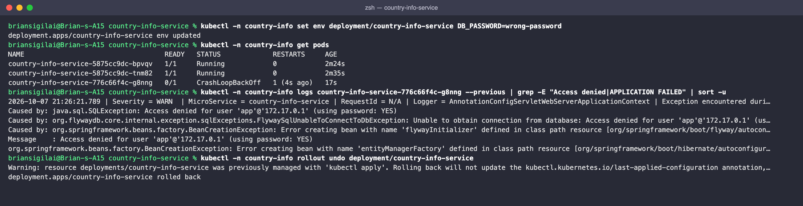
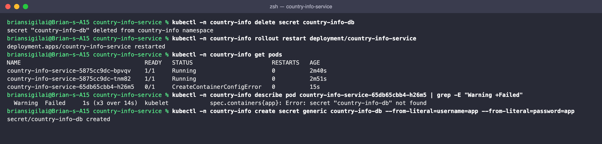
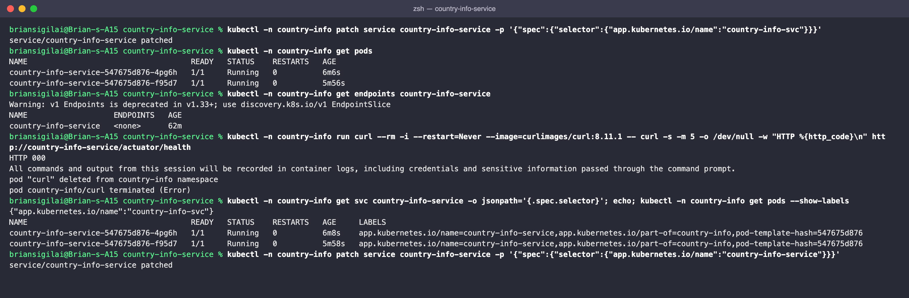
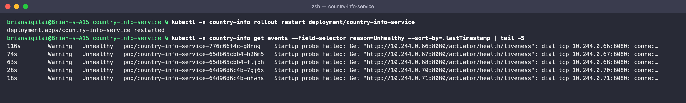
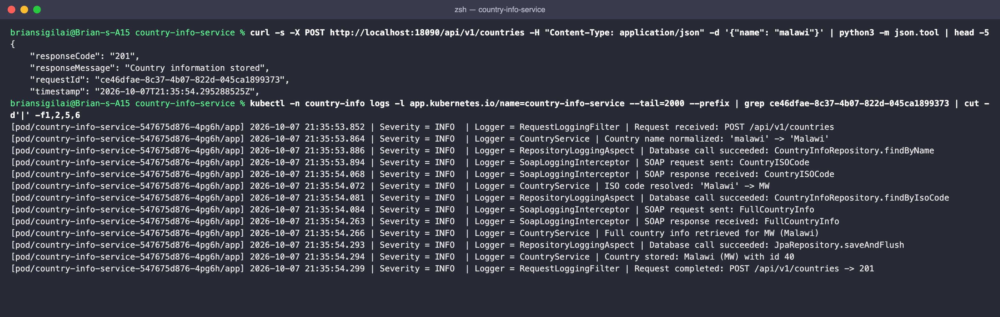
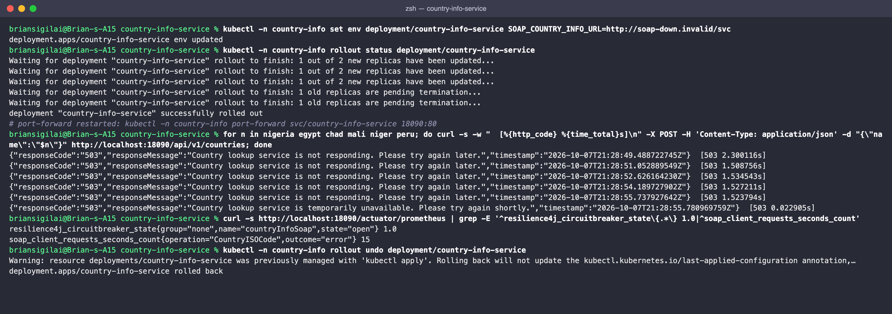
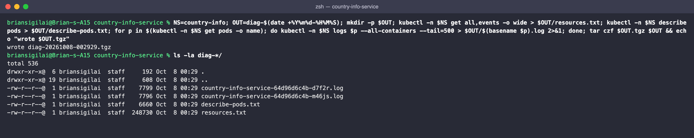

# Troubleshooting on Kubernetes / OpenShift

This guide covers the **country-info-service** microservice running in Kubernetes or OpenShift.
All commands assume the namespace `country-info`. To avoid typing it every time:

```bash
kubectl config set-context --current --namespace=country-info
```

On **OpenShift**, `oc` works the same as `kubectl` (`oc get pods`, `oc describe pod`, `oc logs ...`).

## Troubleshooting by symptom



Each symptom is covered in detail in [section 3](#3-pod-status--cause--fix), and the most common
ones can be reproduced safely on minikube in [section 4](#4-reproduce-common-failures).

## 1. Triage in 60 seconds

Start here. Most problems are visible by the third command.

```bash
kubectl -n country-info get pods -o wide
```

```bash
kubectl -n country-info describe pod <pod-name>
```

```bash
kubectl -n country-info get events --sort-by=.lastTimestamp | tail -20
```

```bash
kubectl -n country-info logs <pod-name> --previous --tail=100
```

```bash
kubectl -n country-info top pods
```

```bash
kubectl -n country-info get endpointslices -l kubernetes.io/service-name=country-info-service
```

- `--previous` shows the logs of the **last crashed** container. The current container may still
  be empty, so this is what you need for `CrashLoopBackOff`.
- The last command shows which pod IPs the Service sends traffic to (`kubectl get endpoints
  country-info-service` works too, but is deprecated since Kubernetes 1.33).
- **Events expire after about an hour.** For older incidents, rely on the application logs and the
  Prometheus metrics.



Then check the app's own view of its health:

```bash
kubectl -n country-info port-forward svc/country-info-service 8080:80
```

```bash
curl -s http://localhost:8080/actuator/health
```

## 2. Probes: what a failure does

| Probe | Endpoint | When it fails | Event |
|---|---|---|---|
| **Startup** | `/actuator/health/liveness` every 5s, up to 2 minutes | Keeps liveness and readiness on hold while the JVM boots and Flyway runs. Only after 2 minutes of failures is the container restarted | `Unhealthy: Startup probe failed: ... connection refused` (normal for the first ~10s) |
| **Liveness** | `/actuator/health/liveness` every 10s | The container is **restarted** (RESTARTS goes up) | `Unhealthy: Liveness probe failed: ...` |
| **Readiness** | `/actuator/health/readiness` every 5s | The pod is **removed from the Service endpoints** (no restart). It gets traffic again once it passes | `Unhealthy: Readiness probe failed: ...` |

Liveness deliberately does not check the database or the SOAP service: an outage of a dependency
must not restart every pod. The probes need no authentication and the app listens on all
interfaces (`0.0.0.0:8080`), so the kubelet can always reach them.

## 3. Pod status → cause → fix

| Status / symptom | Likely causes | How to confirm | Fix |
|---|---|---|---|
| **`Pending`** | Not enough CPU/memory for the pod's `requests`; taints, `nodeSelector` or affinity rules; namespace quota exceeded | `describe pod` → Events: `FailedScheduling` with the reason; `kubectl describe quota -n country-info` | Add capacity (`minikube start --cpus=4 --memory=6144`), lower `requests` in `deployment.yaml`, fix the scheduling rules or raise the quota |
| **`ErrImagePull` / `ImagePullBackOff`** | Wrong image name or tag; missing or wrong `imagePullSecret`; registry unreachable from the nodes. If Argo CD shows **Synced** but the pods don't start, it is usually this | `describe pod` → `Failed to pull image ...`; on minikube `minikube image ls \| grep country-info` | Fix the tag (re-run `scripts/deploy.sh` locally); on a real cluster check the registry path and the pull secret |
| **`CreateContainerConfigError`** | A referenced Secret or ConfigMap, or one of its keys, does not exist | `describe pod` names it, e.g. `secret "country-info-db" not found` | Check the namespace and key names; `DB_USERNAME=... DB_PASSWORD=... scripts/deploy.sh` recreates the Secret |
| **`CrashLoopBackOff`** | The app exits on startup: missing env/ConfigMap/Secret value, bad config, database unreachable or wrong credentials; also caused by repeated OOMKills or failing liveness probes | `kubectl logs <pod> --previous` | See [section 5](#5-app-crashes-on-startup) |
| **RESTARTS keeps climbing** | Liveness probe failing (app hung, or probe too strict under load), or OOMKills | `describe pod` → **Last State** shows `Reason` and `Exit Code`; Events show `Unhealthy` | Read `logs --previous`; raise `timeoutSeconds`; scale out; see OOMKilled |
| **`OOMKilled`, exit code 137** | The container used more memory than its **limit**: it is killed and restarted (not evicted). CPU over the limit is only throttled, never killed | `describe pod` → `Last State: Terminated, Reason: OOMKilled`; compare `kubectl top pods` with the limits | The JVM's heap + metaspace + thread stacks must fit in the limit. Heap is capped at 75% of it (`-XX:MaxRAMPercentage=75`); raise `limits.memory` in `deployment.yaml` |
| **`Evicted`** | The node is under memory or disk pressure. Pods using more than their `requests` are evicted first (BestEffort, then Burstable), even below their own limit | `kubectl get pods` shows `Evicted`; `describe pod` → `The node was low on resource: memory` (or `ephemeral-storage`) | Set `requests` close to real usage (`kubectl top pods`). Watch ephemeral storage: logs and `/tmp` (the `emptyDir` is capped at 1Gi). Delete evicted pods with `kubectl delete pod --field-selector=status.phase=Failed` |
| **Running, but no traffic** | The Service selector does not match the pod labels (cause #1); pods `0/1` because readiness fails; Service `targetPort` ≠ container port; a NetworkPolicy blocks traffic; DNS (`country-info-service.country-info.svc.cluster.local`); CNI issues (ask the cluster admin) | Endpoint slice empty (section 1); compare `kubectl get svc country-info-service -o jsonpath='{.spec.selector}'` with `kubectl get pods --show-labels` | Fix the selector or labels; see [section 4.4](#44-running-but-no-traffic-service-selector-mismatch) |
| **`Running` but `0/1` READY** | Readiness probe failing: app still starting, or shutting down | `describe pod` → `Readiness probe failed`; `curl .../actuator/health/readiness` | Wait for startup (up to ~2 min allowed); if it never becomes ready, read the logs |

Events you can ignore right after a deploy: `Startup probe failed: ... connection refused` (the
JVM is not listening yet) and the HPA's `FailedGetResourceMetric` / `cpu: <unknown>`
(metrics-server needs about a minute for new pods).

## 4. Reproduce common failures

These walkthroughs break the deployment on minikube on purpose, show what the failure looks like,
and restore it. They were run against this deployment. Thanks to the rolling update settings
(`maxUnavailable: 0`), **the old pods keep serving traffic** while the broken new pod fails, so
none of them causes an outage.

When you are done with all of them, re-sync the cluster with the manifests:

```bash
scripts/deploy.sh
```

### 4.1 `ImagePullBackOff`: image tag that does not exist

```bash
kubectl -n country-info set image deployment/country-info-service app=country-info-service:9.9.9
```

```bash
kubectl -n country-info get pods
```

```bash
kubectl -n country-info describe pod <the-new-pod> | tail -8
```

The new pod shows `ImagePullBackOff`, `describe` shows `Back-off pulling image
"country-info-service:9.9.9"`, and the two old pods stay `Running`.



Restore:

```bash
kubectl -n country-info rollout undo deployment/country-info-service
```

### 4.2 `CrashLoopBackOff`: wrong database password

```bash
kubectl -n country-info set env deployment/country-info-service DB_PASSWORD=wrong-password
```

```bash
kubectl -n country-info get pods
```

```bash
kubectl -n country-info logs <the-new-pod> --previous | grep -E "Access denied|APPLICATION FAILED"
```

The new pod goes `Error` → `CrashLoopBackOff` with a growing RESTARTS count; the previous
container's log shows `Access denied for user 'app'`.



Restore:

```bash
kubectl -n country-info rollout undo deployment/country-info-service
```

### 4.3 `CreateContainerConfigError`: missing Secret

```bash
kubectl -n country-info delete secret country-info-db
```

```bash
kubectl -n country-info rollout restart deployment/country-info-service
```

```bash
kubectl -n country-info get pods
```

```bash
kubectl -n country-info describe pod <the-new-pod> | grep -E "Warning +Failed"
```

The new pod shows `CreateContainerConfigError`, and `describe` names the problem:
`Error: secret "country-info-db" not found`.



Restore: recreate the Secret. The waiting pod starts on its own, no restart needed:

```bash
kubectl -n country-info create secret generic country-info-db --from-literal=username=app --from-literal=password=app
```

### 4.4 Running, but no traffic: Service selector mismatch

```bash
kubectl -n country-info patch service country-info-service -p '{"spec":{"selector":{"app.kubernetes.io/name":"country-info-svc"}}}'
```

```bash
kubectl -n country-info get pods
```

```bash
kubectl -n country-info get endpoints country-info-service
```

```bash
kubectl -n country-info run curl --rm -i --restart=Never --image=curlimages/curl:8.11.1 -- curl -s -m 5 -o /dev/null -w "HTTP %{http_code}\n" http://country-info-service/actuator/health
```

```bash
kubectl -n country-info get svc country-info-service -o jsonpath='{.spec.selector}'; echo; kubectl -n country-info get pods --show-labels
```

All pods are `1/1 Running`, yet the Service has **no endpoints** (`<none>`) and calls through it
fail (`HTTP 000`). The selector (`country-info-svc`) does not match the pods' label
(`country-info-service`).



Restore:

```bash
kubectl -n country-info patch service country-info-service -p '{"spec":{"selector":{"app.kubernetes.io/name":"country-info-service"}}}'
```

### 4.5 Probe events during a rollout

```bash
kubectl -n country-info rollout restart deployment/country-info-service
```

```bash
kubectl -n country-info get events --field-selector reason=Unhealthy --sort-by=.lastTimestamp | tail -5
```

Each new pod logs a few `Startup probe failed: ... connection refused` events while the JVM
boots. That is expected: the startup probe holds liveness off until the app answers.



## 5. App crashes on startup

Read the end of the previous container's log:

```bash
kubectl -n country-info logs deploy/country-info-service --previous --tail=60
```

| Log message contains | Cause | Fix |
|---|---|---|
| `Communications link failure` / `Access denied` / `Unknown database` | The app cannot use the database configured in `DB_URL` (outside this deployment) | Check `DB_URL` in `k8s/app/config.env` and the credentials (`DB_USERNAME=... DB_PASSWORD=... scripts/deploy.sh`); the app recovers on its own once the database is reachable |
| `FlywayValidateException` / `Migration checksum mismatch` | A migration file was edited after it ran | Never edit applied migrations; add a new `V2__...sql` |
| `Schema-validation: missing column` / `missing table` | Entity changed without a matching Flyway migration | Add the migration under `src/main/resources/db/migration` |
| `Could not resolve placeholder` | A required env var is missing | `kubectl exec <pod> -- env \| sort` and compare with `config.env` |

Inspect the configuration a pod actually received:

```bash
kubectl -n country-info exec deploy/country-info-service -- env | grep -E 'DB_URL|SOAP_|LOG'
```

```bash
kubectl -n country-info get configmap -l app.kubernetes.io/part-of=country-info -o yaml
```

## 6. API returns errors

Every response carries a `requestId` (also in the `X-Request-ID` header). Use it to find every
log line for that request across all pods:

```bash
kubectl -n country-info logs -l app.kubernetes.io/name=country-info-service --tail=2000 --prefix | grep <requestId>
```

Add `| cut -d'|' -f1,2,5,6` to keep only the pod, time, severity, logger and message. You will see the whole story: `Request received` → `Country name normalized` → `SOAP request sent`
/ `SOAP response received` (with XML payloads) → `Database call succeeded` → `Request completed`
with `responseCode` and `transactionCost` (ms).



| Response | Meaning | What to check |
|---|---|---|
| `400 Request validation failed` | Bad input; `errors` lists each field | Fix the request body |
| `404 No country found with the name 'X'` | The SOAP service does not know that name | The service is case-sensitive and uses its own names (e.g. some multi-word countries); try SoapUI `CountryISOCode` directly |
| `409` | `POST` of a country that is already stored (the existing record is in `data`); duplicate ISO code or stale `version` on PUT | For POST, use the returned record; for PUT, GET the record again and resend with its current `version` |
| `503 Country lookup service is not responding` | SOAP upstream down/slow; 3 attempts failed | [Section 7](#7-soap-upstream-issues-503s) |
| `503 Country lookup service is temporarily unavailable` | Circuit breaker is **open** (too many recent SOAP failures); calls fail fast for 30s | [Section 7](#7-soap-upstream-issues-503s); it closes automatically once calls succeed |
| `503 The database is taking too long to respond` / `The database is temporarily unavailable` | The database at `DB_URL` is slow or down (outside this deployment). The app fails fast instead of hanging and recovers on its own | Check the database; the log line with `logType="DATABASE_TIMEOUT"` names the operation and cause |
| `500 An unexpected error occurred` | Bug or unexpected failure | Search the logs for the `requestId`; the ERROR line has the stack trace |

## 7. SOAP upstream issues (503s)

Check from inside a pod that the cluster can reach the SOAP host (DNS, egress, proxy):

```bash
kubectl -n country-info run soap-check --rm -it --restart=Never --image=curlimages/curl:8.11.1 -- curl -s -o /dev/null -w "%{http_code} %{time_total}s\n" "http://webservices.oorsprong.org/websamples.countryinfo/CountryInfoService.wso?WSDL"
```

Look at the circuit breaker, retries and SOAP latency in the metrics:

```bash
kubectl -n country-info port-forward svc/country-info-service 8080:80
```

```bash
curl -s http://localhost:8080/actuator/prometheus | grep -E '^resilience4j_circuitbreaker_state|^resilience4j_retry_calls_total|^soap_client_requests_seconds_(count|sum)'
```

- `resilience4j_circuitbreaker_state{state="open"} 1.0` → the breaker is open.
- `soap_client_requests_seconds_count{outcome="error"}` rising → transport failures (timeouts,
  connection refused). Log lines read e.g. `SOAP call failed: CountryISOCode - HttpTimeoutException: request timed out`.
- Stored countries are **still served** while SOAP is down: `GET` endpoints do not call SOAP, and
  re-submitting an already-stored country is answered with 409 straight from the database.

If the upstream is just slow, raise `SOAP_READ_TIMEOUT` in `k8s/app/config.env` and redeploy.

**Reproduce it:** point the pods at a SOAP host that does not exist, then submit six countries
that are not stored yet (with the port-forward above running):

```bash
kubectl -n country-info set env deployment/country-info-service SOAP_COUNTRY_INFO_URL=http://soap-down.invalid/svc
```

```bash
kubectl -n country-info rollout status deployment/country-info-service
```

Restart the port-forward (it is attached to a replaced pod), then:

```bash
for n in nigeria egypt chad mali niger peru; do curl -s -w "  [%{http_code} %{time_total}s]\n" -X POST -H 'Content-Type: application/json' -d "{\"name\":\"$n\"}" http://localhost:8080/api/v1/countries; done
```

```bash
curl -s http://localhost:8080/actuator/prometheus | grep -E '^resilience4j_circuitbreaker_state\{.*\} 1.0|^soap_client_requests_seconds_count'
```

The first five return `503 Country lookup service is not responding` after ~1.5s each (three
attempts with backoff); the sixth returns `503 ... temporarily unavailable` in ~10ms because the
circuit is now **open**, and the metrics show `state="open"`.



Restore:

```bash
kubectl -n country-info rollout undo deployment/country-info-service
```

## 8. Performance and scaling

```bash
kubectl -n country-info top pods
```

```bash
kubectl -n country-info get hpa -w
```

```bash
kubectl -n country-info describe hpa country-info-service
```

- HPA stuck at `<unknown>` for more than a few minutes → metrics-server missing:
  `minikube addons enable metrics-server` (or install it on your cluster).
- Not scaling up under load → CPU may not be the bottleneck (e.g. waiting on SOAP). Check
  `soap_client_requests_seconds` and `http_server_requests_seconds` in `/actuator/prometheus`.
- Cache effectiveness: `cache_gets_total{cache="isoCodes|countryInfo",result="hit|miss"}`.

## 9. Logs and log levels

Logs go to stdout (collected by Kubernetes; plain text in pods, colored by outcome only when
running in a terminal or IDE) in the format
`timestamp | Severity | MicroService | RequestId | Logger | message | key="value" ...`; phone
numbers and SOAP passwords are masked. A rolling copy is also written to `/tmp/logs` inside the
pod (an `emptyDir`, lost when the pod is replaced: rely on stdout for history).

Follow all app pods at once:

```bash
kubectl -n country-info logs -f -l app.kubernetes.io/name=country-info-service --prefix --max-log-requests=10
```

Only errors and warnings:

```bash
kubectl -n country-info logs -l app.kubernetes.io/name=country-info-service --tail=1000 | grep -E 'Severity = (ERROR|WARN)'
```

Turn on DEBUG for the app's own packages: set `APP_LOG_LEVEL=DEBUG` in `k8s/app/config.env` and run
`scripts/deploy.sh` (pods roll with the new config). Set it back to `INFO` afterwards.

## 10. Gotchas

- **`kubectl port-forward svc/...` does not load-balance.** It tunnels to a single pod chosen at
  start. If that pod is replaced (rollout, crash), the port-forward dies and every request fails
  with `connection refused` / curl `000`, even though the Service is fine. Restart the
  port-forward. To test real Service behaviour, call it from inside the cluster:
  ```bash
  kubectl -n country-info run curl --rm -it --restart=Never --image=curlimages/curl:8.11.1 -- curl -s http://country-info-service/actuator/health
  ```
- **`kubectl logs -l <selector>` shows only the last 10 lines per pod** unless you pass `--tail`.
  When counting or searching across pods, add `--tail=-1` (everything) or e.g. `--tail=2000`.
- **Same tag, new code:** `scripts/deploy.sh` stamps a hash of the image content into the pod
  template, so reusing a tag still rolls the pods. Applying the manifests by hand with
  `kubectl apply -k k8s/` does not; use `kubectl rollout restart deployment/country-info-service`.
  In the GitOps flow this cannot happen, because every build has its own commit-SHA tag.
- **`kubectl rollout undo` / `set env` / `patch` are temporary:** they change the live cluster but
  not the manifests. Re-run `scripts/deploy.sh` afterwards; with Argo CD `selfHeal`, such manual
  changes are reverted automatically.
- **Secret edited by hand:** the pods only read the Secret at startup. `DB_PASSWORD=...
  scripts/deploy.sh` updates the Secret *and* rolls the pods; after a manual edit, run
  `kubectl -n country-info rollout restart deployment/country-info-service`.
- **Colima/minikube after a reboot:** start them again before deploying:
  ```bash
  colima start
  ```
  ```bash
  minikube start
  ```

## 11. Collect a diagnostics bundle

When escalating, attach this output:

```bash
NS=country-info; OUT=diag-$(date +%Y%m%d-%H%M%S); mkdir -p $OUT; kubectl -n $NS get all,events -o wide > $OUT/resources.txt; kubectl -n $NS describe pods > $OUT/describe-pods.txt; for p in $(kubectl -n $NS get pods -o name); do kubectl -n $NS logs $p --all-containers --tail=500 > $OUT/$(basename $p).log 2>&1; done; tar czf $OUT.tgz $OUT && echo "wrote $OUT.tgz"
```


